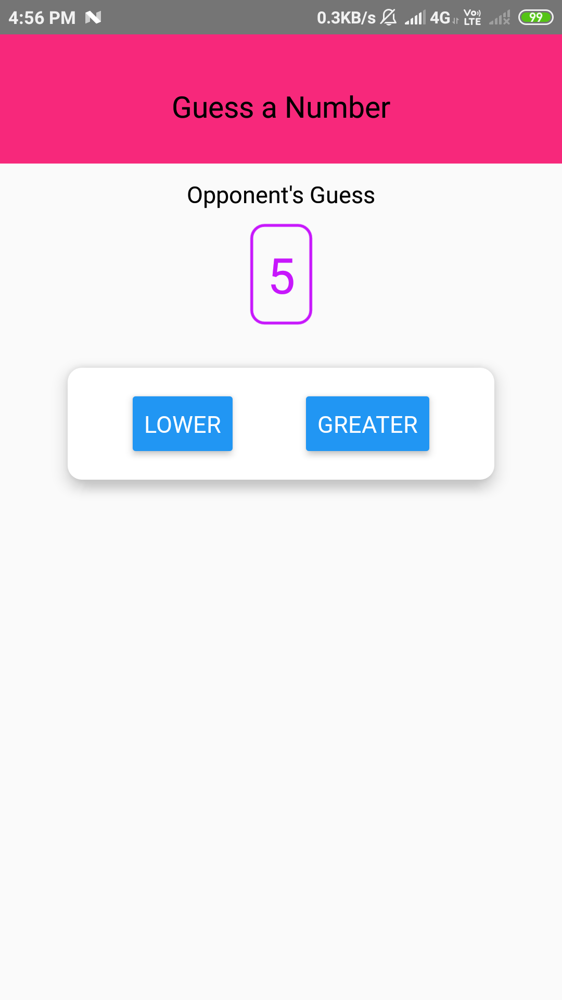

# Guess the Number

A game where user will enter a number and when the game will start user needs to guess that his/her number is lower or higher than the computer generated random number.
If the user will guess wrong than it will show alert message and user will guess right than computer will generate another number according to the entered number by user. 

 
 

